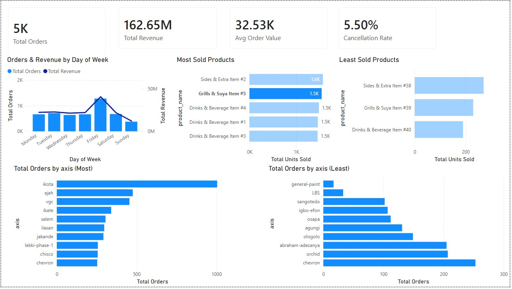
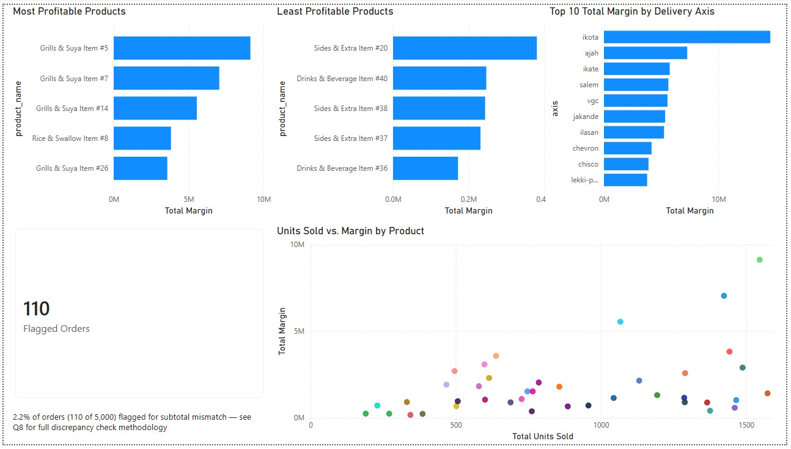

# Ikota Eats: Power BI Dashboard

This dashboard visualizes the findings from the [SQL analysis](../README.md) as an 
interactive Power BI report. Built in Power BI Desktop, connected directly to the 
PostgreSQL database via Import mode.

## Page 1: Overview

**What it shows:**
- KPI summary: 5,000 total orders, ₦162.65M total revenue, ₦32.53K average order value, 
  5.50% overall cancellation rate
- **Orders & Revenue by Day of Week** — reveals that Friday drives both the highest order 
  volume and the highest total revenue, despite having the lowest average order value of 
  any day. This visual captures the Friday pattern that recurs throughout the analysis: 
  high volume, smaller typical orders, and (as shown elsewhere) the highest cancellation rate
- **Most/Least Sold Products** — the top 5 and bottom 3 products by units sold, confirming 
  that sales volume is concentrated in Sides & Extras and Drinks & Beverage categories at 
  both ends of the ranking
- **Orders by Axis (Most/Least)** — the top 10 and bottom 10 delivery zones by order volume, 
  showing Ikota's clear dominance (over double the next-highest zone) and the sharp drop-off 
  toward low-coverage zones like General Paint and LBS

Full interactive file: [Ikota_eats_dashboard.pbix](Ikota_eats_dashboard.pbix)

## Page 2: Product & Revenue Deep Dive

**What it shows:**
- **Most/Least Profitable Products** — top 5 and bottom 5 products by total margin, 
  confirming that Grills & Suya items dominate the most profitable end, while Sides & 
  Extras and Drinks & Beverage cluster at the low end — the opposite pattern from units 
  sold, where those same categories lead in volume
- **Top 10 Margin by Delivery Axis** — Ikota leads on profit as well as volume, confirming 
  its dominance isn't just about order count
- **Units Sold vs. Margin by Product** (scatter) — visually demonstrates that sales volume 
  and profitability are not correlated in this dataset. High-volume products cluster at 
  moderate-to-low margin, while the highest-margin product sits at a mid-range volume, 
  not the top seller
- **Flagged Orders card** — 110 of 5,000 orders (2.2%) flagged for a subtotal-vs-line-items 
  mismatch, consistent with the Q8 discrepancy check

Full interactive file: [Ikota_eats_dashboard.pbix](Ikota_eats_dashboard.pbix)